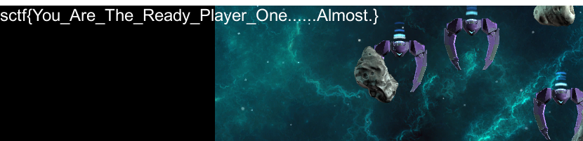
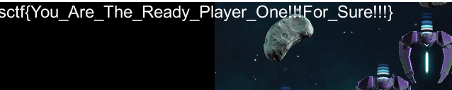
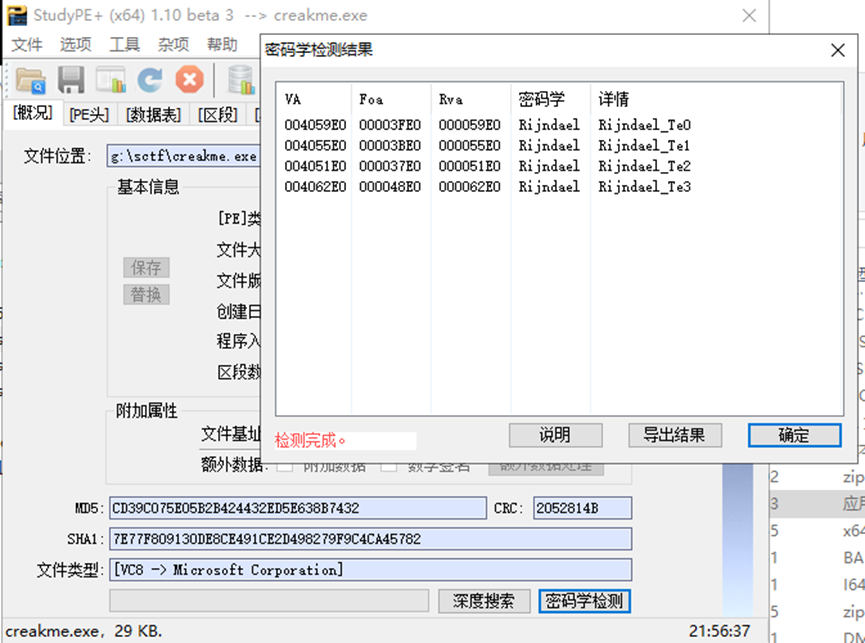
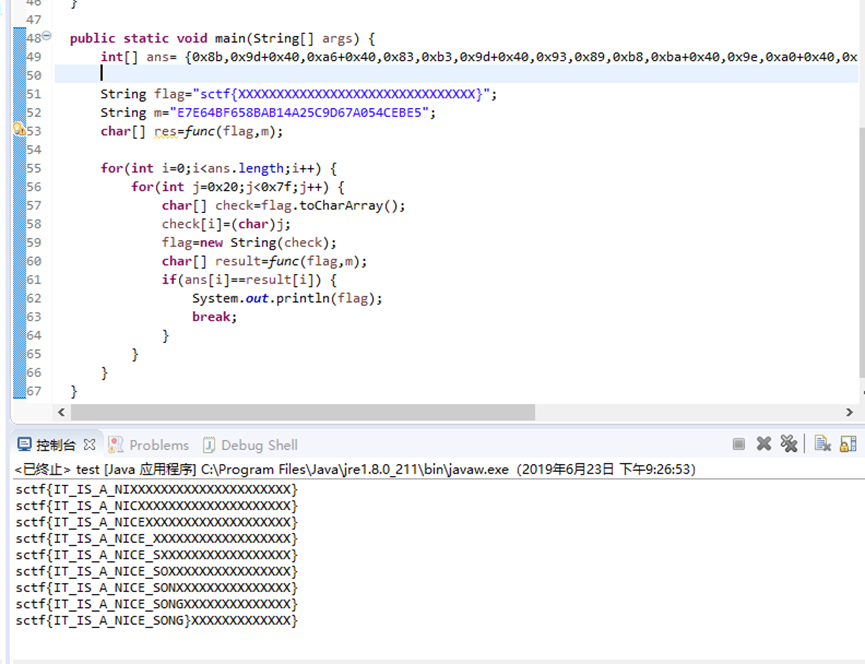
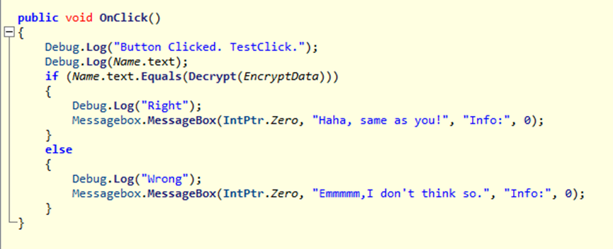
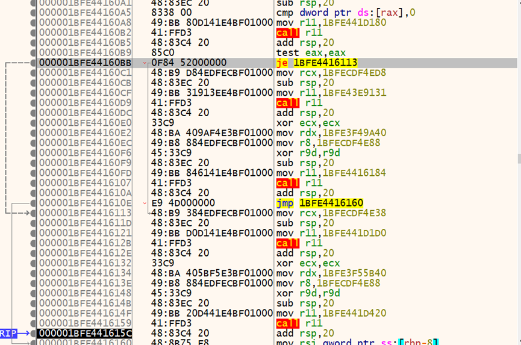
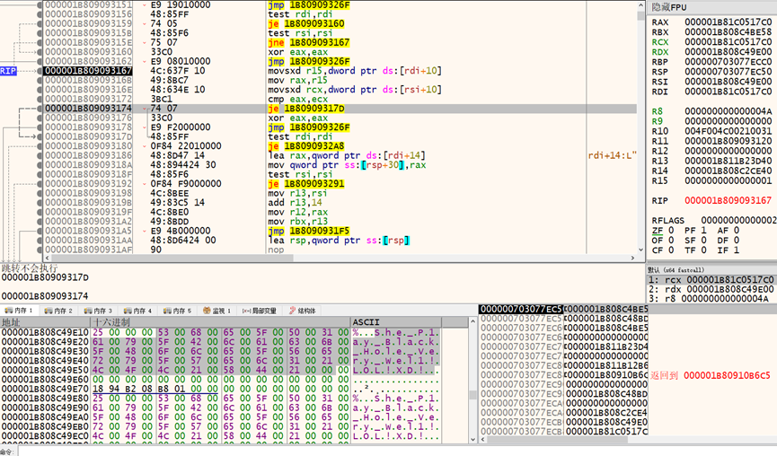

# SCTF2019 writeup


## 0x00 签到

### 题目内容

`cat /flag` in

data:image/jpeg;base64,/9j/4QBkRXhpZgAATU0AKgAAAAgABYdpAAQAAAABAAAASgESAAQAAAABAAAAAAE...

### 操作内容

关注Syclover 输入cat /flag得到flag，注意有空格。

### flag值

`sctf{We1c0me_2_sctf_h3Ve_Fun! }`

## 0x01 头号玩家

### 题目内容

相信我，电影《头号玩家》比CTF更有趣。 https://share.weiyun.com/53hDBkd

### 操作内容

玩一玩发现飞机可以向下飞出显示边界，得到：



但这并不是正确的flag，尝试能不能向上飞出边界，发现可以。


### flag值

`sctf{You_Are_The_Ready_Player_One!!!For_Sure!!!}`

##  0x02 Maaaaaaze

### 题目内容

相信我，走迷宫比《头号玩家》还有趣一点。flag: sctf{md5(迷宫中最长路径的长度)}

（附件较大，可在攻防世界下载，后面的大文件也可以下载）

### 操作内容

最长路径问题可以找到`poj 1383 Labyrinth`的解法，我们面临的问题是如何将页面转化成较标准的输入，这里采取的方法是将html中的每个色块变成标准输入中的九块。


`poj1383.cpp`

``` cpp
#include<cstdio>
#include<cstring>
#include<queue>
#include<algorithm>
#include<stack>
using namespace std;
int n,m;
char mapp[1010][1010];
int vis[1010][1010];
int sx,sy;
struct node{
    int x;
    int y;
    int setp;
}pr,ne;
int ans;
bool check(int x,int y)
{
    if(x<0||y<0||x>=n||y>=m||vis[x][y]||mapp[x][y]=='#')
        return false;
    return true;

}

void bfs(int xx,int yy)
{
    ans=0;
    memset(vis,0,sizeof(vis));
    queue<node>q;
    int fx[4]={0,0,1,-1};
    int fy[4]={1,-1,0,0};
    pr.x =xx;
    pr.y =yy;
    pr.setp =0;
    vis[xx][yy]=1;
    q.push(pr);
    while(!q.empty() )
    {
        pr=q.front() ;
        q.pop() ;
        for(int i=0;i<4;i++)
        {
            ne.x =pr.x +fx[i];
            ne.y =pr.y +fy[i];
            ne.setp =pr.setp +1;
            if(check(ne.x ,ne.y ))
            {

                vis[ne.x ][ne.y ]=1;
                if(ne.setp >ans)
                {
                    ans=ne.setp ;
                    sx=ne.x ;
                    sy=ne.y ;
                }
                q.push(ne);
            }
        }

     }
}

int main()
{
    int t;
    scanf("%d",&t);
    while(t--)
    {
        scanf("%d%d",&m,&n);
         bool flag = false;
        for(int i=0;i<n;i++)
        {
            scanf("%s",mapp[i]);
            if(flag) continue;
            for(int j=0;j<m;j++)
            {
                if(mapp[i][j]=='.')
                {
                    sx=i;
                    sy=j;
                    flag=true;
                }
            }
        }
        bfs(sx,sy);
        bfs(sx,sy);
        printf("Maximum rope length is %d.\n",ans );
    }
    return 0;
}
```

注意放大后的地图求出的长度为三倍正确长度，计算md5即可。

### flag值

 `sctf{9529fbba677729d3206b3b9073d1e9ca}`

## 0x03 warmup

### 题目内容

just warmup

`server.py`

``` python
#!/usr/bin/python
# -*- coding: utf-8 -*-

from Crypto.Cipher import AES
from Crypto.Util.strxor import strxor
from Crypto.Random import get_random_bytes
from FLAG import flag

class MAC:
    def __init__(self):
        self.key = get_random_bytes(16)
        self.iv = get_random_bytes(16)

    def pad(self, msg):
        pad_length = 16 - len(msg) % 16
        return msg + chr(pad_length) * pad_length

    def unpad(self, msg):
        return msg[:-ord(msg[-1])]

    def code(self, msg):
        res = chr(0)*16
        for i in range(len(msg)/16):
            res = strxor(msg[i*16:(i+1)*16], res)
        aes = AES.new(self.key, AES.MODE_CBC, self.iv)
        return aes.encrypt(res).encode('hex')

    def identity(self, msg, code):
        if self.code(msg) == code:
            msg = self.unpad(msg)
            if msg == 'please send me your flag':
                print 'remote: ok, here is your flag:%s' % flag
            else:
                print 'remote: I got it'
        else:
            print 'remote: hacker!'


if __name__ == '__main__':
    mac = MAC()
    message = 'see you at three o\'clock tomorrow'
    print 'you seem to have intercepted something:{%s:%s}' %(mac.pad(message).encode('hex'), mac.code(mac.pad(message)))
    print 'so send your message:'
    msg = raw_input()
    print 'and your code:'
    code = raw_input()
    mac.identity(msg.decode('hex'), code)
    exit()
```
### 操作内容

题目自己提供了一种验证机制判断信息是否被篡改，但这种保护机制非常脆弱，可以利用`unpad`不检查长度的特性输入任意长度，构造填充保证`code`与原来的信息相同即可。

`solve.py`

``` python
from Crypto.Cipher import AES
from Crypto.Util.strxor import strxor
from Crypto.Random import get_random_bytes

from pwn import *

msg = b"see you at three o'clock tomorrow\x0f\x0f\x0f\x0f\x0f\x0f\x0f\x0f\x0f\x0f\x0f\x0f\x0f\x0f\x0f"

msg1 = msg[:16]
msg2 = msg[16:32]
msg3 = msg[32:]

msgcode = reduce(strxor,[msg1,msg2,msg3])
#这里构造 reduce(strxor,[mystr1,mystr2,mystr3]) == msgcode即可
mystr = 'please send me your flag\x00\x00\x00\x00\x00\x00\x00d;\x1cZ\r\x0f\x06XP+a$6ej8\x18'.encode('hex')

r = remote('47.240.41.112',12345)
# 这里因网络延迟可能有不同的结果，更稳的是用正则表达式
mycode = r.recv()[-34:-2]
r.sendline(mystr)
r.recv()
r.sendline(mycode)
r.interactive()
```

### flag值

`sctf{y0u_4r3_7h3_4p3x_ch4mp10n}`

## 0x04 babygame

（非预期警告）

### 题目内容

not that hard

`server.py`

``` python
#!/usr/bin/python
# -*- coding: utf-8 -*-

from Crypto.Util.number import *
from Crypto.Cipher import AES
from Crypto.Random import get_random_bytes
from binascii import *
from FLAG import flag
from MESSAGE import message


class telecom:
    def __init__(self, name):
        self.name = name
        self.key = get_random_bytes(16)
        self.iv = get_random_bytes(16)

        self.e = 3

        p = getPrime(512)
        q = getPrime(512)
        self.fn = (p-1)*(q-1)

        while True:
            if GCD(self.e, self.fn) != 1:
                p = getPrime(512)
                q = getPrime(512)
                self.fn = (p - 1) * (q - 1)
            else:
                break

        self.d = inverse(self.e, self.fn)
        self.n = p * q

    def RSA_encrypt(self, plaintext):
        assert bytes_to_long(plaintext).bit_length() < 512

        a = getPrime(512)
        b = getPrime(512)
        m = bytes_to_long(plaintext)
        c = pow(a * m + b, self.e, self.n)


        message = 'admin:'+self.name+', your ciphertext is: c='+hex(c)+'\nwith some parameters:a='+hex(a)+', b='+hex(b)+'\n'
        return message

    def RSA_decrypt(self):
        pass

    def broadcast(self):
        message = self.name+':'+'my pub-key is: '+'e='+str(self.e)+','+'n='+hex(self.n)+'\n'
        return message

    def pad(self, msg):
        pad_length = 16 - len(msg) % 16
        return msg + chr(pad_length) * pad_length

    def unpad(self, msg):
        return msg[:-ord(msg[-1])]

    def AES_encrypt(self, message):
        message = self.pad(message)
        aes = AES.new(self.key, AES.MODE_OFB, self.iv)
        return aes.encrypt(message)


    def AES_decrypt(self, message):
        aes = AES.new(self.key, AES.MODE_OFB, self.iv)
        return self.unpad(aes.decrypt(message))


def proof_of_work():
    p = getPrime(512)
    q = getPrime(512)
    n = p*q
    e = 65537
    fn = (p-1)*(q-1)
    d = inverse(e, fn)

    print "pubkey:{e, n}={65537, %s}\n" %hex(n)
    print 'Give me something you want to encrypt:'
    sys.stdout.flush()
    m = int(raw_input())
    c = pow(m, e, n)

    if m == pow(c, d, n):
        return False
    return True


if __name__ == '__main__':

    if not proof_of_work():
        exit()

    while True:
        print 'You have the following options to do:\n[1]monitor\n[2]forge the message'
        choice = raw_input()

        if int(choice) == 1:

            Alpha = telecom('Alpha')
            Bravo = telecom('Bravo')
            Charlie = telecom('Charlie')

            print Alpha.broadcast()
            print Bravo.broadcast()
            print Charlie.broadcast()

            print Alpha.RSA_encrypt(message)
            print Bravo.RSA_encrypt(message)
            print Charlie.RSA_encrypt(message)
            print 'Alpha:David, make sure you\'ve read this:' + hexlify(Alpha.AES_encrypt(message))+'\n'
        elif int(choice) == 2:
            print 'you can send message to David now:'
            input_cipher = raw_input()
            if Alpha.AES_decrypt(unhexlify(input_cipher)) == message.replace('afternoon', 'morning'):
                print 'you made it, this reward is prepared for you:' + flag
                exit()
            else:
                print 'you failed'
                exit()
        else:
            exit()
```

### 操作内容

这道题我是真的不会做。。。理一理逻辑：

RSA部分：

- c1 = pow(a1*m+b1,3,n1)
- c2 = pow(a2*m+b2,2,n2)
- c3 = pow(a3*m+b3,3,n3)

看上去像是低加密指数广播攻击的变体，但是没搞出来。如果顺利得到m，则可根据`c_old^m_old^m_new == c_new`构造出满足条件的密文。但是我并没有得到m。

绝望之下写了个暴破脚本听天由命。

`solve.py`

``` python
from pwn import *

a = '2876309015779705452366888305262439573788763166307690516374881298523722812888015410123335637158520576337921822077942293722540636301030665959885558890231585990044286294797847764420835513619937505911249327233360092301410410917479406103582609768653235794613608170953380771839155935015675460877365701273987586195456'

def dlcqj(thex):
	res = []
	t = thex.decode('hex')
	for pd in range(1,16):
		for fst in range(38):
			t2 = list(t)
			for i in range(fst,fst+7):
				t2[i] = chr(ord(t2[i])^ord('\x0c\t\x06\x0b\x1b\x00\x08'[i-fst]))
			t2[-1] = chr(ord(t2[-1])^pd^(pd+2))
			res.append("".join(t2).encode('hex'))
	return res

myres = []

for i in range(570):
	flag = 1
	while flag:
		try:
			r = remote('47.240.41.112',54321)
			r.recv()
			r.sendline(a)
			r.recvuntil("forge the message")
			r.sendline("1")
			r.recvuntil("make sure you've read this:")
			thex = r.recv(96)
			res = dlcqj(thex)
			r.recvuntil("message")
			r.sendline("2")
			r.recvuntil('you can send message to David now:')
			r.sendline(res[i])
			r.recvuntil("you")
			myres.append(r.recvuntil('\n'))
			r.close()
			flag = 0
		except:
			pass
```
这个脚本成功运行的条件在于明文中`afternoon`后没有任何字符。跑了一会儿，跳出来这个：

'you made it, this reward is prepared for you:sctf{7h15_ch4ll3n63_15_n07_h4rd_f0r_y0u_r16h7?}\n'

原本打算暴破不成功再试试后面加感叹号或者句号的，全靠出题人抬一手啊。

### flag值

`sctf{7h15_ch4ll3n63_15_n07_h4rd_f0r_y0u_r16h7?}`

## 0x05 babyre

### 题目内容
boring game~~
### 操作内容

password 1 走3d迷宫，路线ddwwxxssxaxwwaasasyywwdd

password 2 尝试输入，发现是base64，输入base64字符串解密得到sctf_9102，c2N0Zl85MTAy

password 3 特征发现是SM4，验证第一轮生成的结果，且子密钥是0，将所需值加密的结果做反序变换作为输入即可。

flag：sctf{ddwwxxssxaxwwaasasyywwdd-c2N0Zl85MTAy(fl4g_is_s0_ug1y!)}


### flag值

`sctf{ddwwxxssxaxwwaasasyywwdd-c2N0Zl85MTAy(fl4g_is_s0_ug1y!)}`

## 0x06 Crackme

### 题目内容
Crackme
### 操作内容

用StudyPE扫描下文件，发现无壳，疑似有AES。



调试程序，发现有对密文base64的比较，跟入加密函数，发现key为 sycloversyclover，iv为sctfsctfsctfsctf，AES CBC，提取密文解密后得到`b'sctf{Ae3_C8c_I28_pKcs79ad4}\x05\x05\x05\x05\x05'`。


### flag值

`sctf{Ae3_C8c_I28_pKcs79ad4}`

## 0x07 Strange apk

### 题目内容

Tony收到了一个奇怪的apk，为什么它只能在模拟器运行呢？

### 操作内容

解压apk，发现 assets里有个data文件，用十六进制打开，发现大量syclover字符串，尝试异或，发现是个压缩包（实际上是apk），分析这个apk。

首先发现了一个Base64字符串c2N0ZntXM2xjMG1l，得到sctf{W3lc0me

又发现了一个可疑字符串"~8t808_8A8n848r808i8d8-8w808r8l8d8}8"，去掉8得到~t0_An4r0id-w0rld}拼接得到flag。


### flag值

`sctf{W3lc0me~t0_An4r0id-w0rld}`

## 0x08 music

### 题目内容

Listen to music

### 操作内容

用jeb打开dex文件，发现 一个疑似加密函数c.a
IDA动态调试发现第一个参数为输入，第二个为hellosctf的MD5值大写，验证部分按照字节比较。

保持输入开头不变，前面已经验证过的也不变，可以按照字节爆破。

处理char时，发现自己爆破结果与实际调试结果不符，且有一定规律，尝试修改部分字节和代码，最终成功爆破。



### flag值

`sctf{IT_IS_A_NICE_SONG}`

## 0x09 Who is he?

### 题目内容
Who is he? https://share.weiyun.com/5txeW8h
### 操作内容

发现是个unity，尝试反编译Assembly-CSharp.dll发现给出了加密base64字符串和key，发现了输入与解密后原文进行比较，决定debug在内存中找。



下断点MessageBoxW，可以大致定位。命中断点后返回到用户代码，再返回一次，可以看到有个判断跳转，猜测到了OnClick函数



在je上面一个call下断点并跟进，再次跟进，到了字符串比较函数，由于是明文比较，可以直接看到flag。



### flag值

`sctf{She_P1ay_Black_Hole_Very_Wel1!LOL!XD!}`

[poj 代码来源](https://blog.csdn.net/qq_39576425/article/details/76559286)